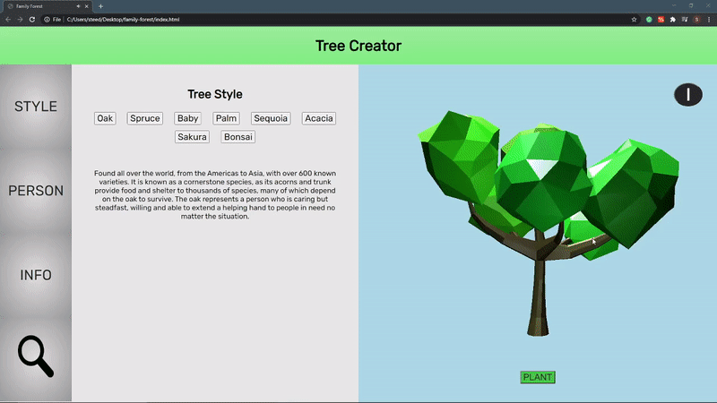

## Family Forest

A mixed reality experience designed for the [Helio browser](https://www.magicleap.com/en-us/news/for-creators/whats-new-with-the-lumin-web-platform) in the [Magic Leap One](https://www.magicleap.com/en-us/magic-leap-1)

### Built With

- [Prismatic](https://developer.magicleap.com/en-us/learn/guides/hello-prismatic)
- [Three.js](https://threejs.org/)

### Demo

IMPORTANT: This is just a brief overview of the ui/ux from Google Chrome. I'm waiting on a copy of the video showcasing the mixed reality capabilities

**Features**

- "Tree creator" WebGL tool with 3D viewer implemented using Three.js
- Users customize trees to their family/friends
- Trees can be custom placed to create a forest surrounding the user (in MR)
- Raycast scanning tool that allows users to see the information for each tree (in MR)
- Engaging sound effects for all actions
- Trees wiggle when first looked at (in MR)
